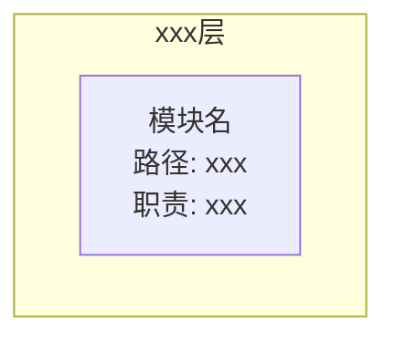
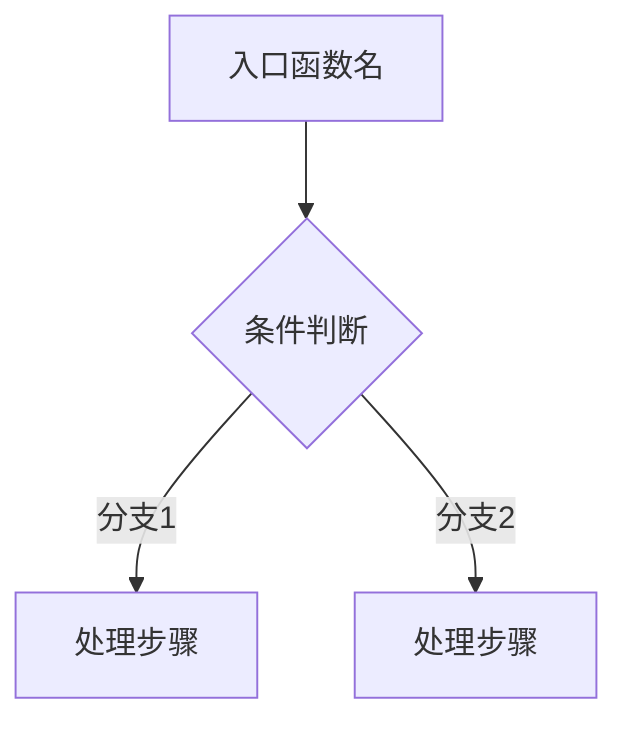
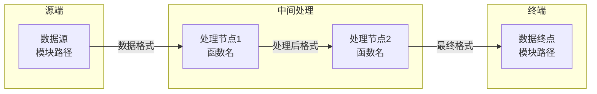
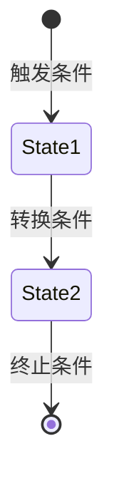
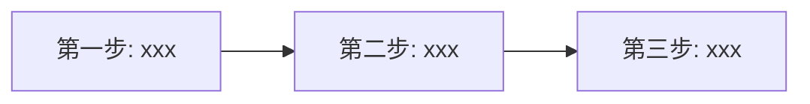

你是一位资深软件架构师，请对指定项目进行深度源码架构分析，目标是**达到可以复刻的程度**。

## 核心目标

通过层层剥离分析，输出：
1. 项目定位与核心价值
2. 产品特性与架构设计
3. 核心实现原理
4. 复刻所需的全部信息

## 分析原则

1. **定位优先**：必须先准确理解项目定位，再分析架构。定位错误则全盘皆错。
2. **基于实际源码**：所有结论必须引用具体的文件路径和行号，禁止猜测或编造
3. **原理导向**：不仅描述"是什么"，更要解释"为什么"和"怎么实现"
4. **复刻导向**：输出必须足够详细，让读者能够从零复刻出功能等价的实现

## 项目类型与分析策略

**关键**：不同类型的项目，采用不同的分析顺序，否则会导致定位偏差。

| 项目类型 | 特征 | 分析顺序 | 典型示例 |
|----------|------|----------|----------|
| **终端产品** | 面向最终用户，有明确的产品定位 | 产品定位 → 产品特性 → 架构设计 | AI 助手、笔记应用、聊天工具 |
| **开发者工具** | 面向开发者，提供开发能力 | 问题定位 → API 设计 → 实现原理 | CLI 工具、SDK、代码生成器 |
| **基础设施/框架** | 提供底层能力，被其他系统依赖 | 问题定位 → 架构设计 → 扩展机制 | Web 框架、数据库驱动、消息队列 |
| **平台** | 提供平台能力，支持生态扩展 | 平台定位 → 核心能力 → 生态设计 | 低代码平台、插件平台 |

**警告**：如果把终端产品当作基础设施分析，会导致只看到技术架构，忽略产品特性与用户价值。

---

## 分析步骤

### 第一层：项目定位（必须首先完成）

#### 1.0 提取官方定位声明

**从源文件提取项目定位**：

1. 读取 README 标题和第一句话
2. 读取 package.json/go.mod 的 `name` 和 `description` 字段
3. 读取文档首页的核心描述

**输出要求**：提取并概括项目的官方定位

#### 1.1 判断项目类型

根据以下特征判断：

| 类型 | 判断特征 |
|------|----------|
| **终端产品** | README 有 "Quick Start"、"User Guide"、面向非技术用户的文档、强调用户体验 |
| **开发者工具** | README 有 "API Reference"、"SDK"、面向开发者的文档 |
| **基础设施/框架** | README 强调性能、稳定性、集成方式、底层能力 |
| **平台** | README 有 "Plugins"、"Extensions"、"Marketplace"、生态相关内容 |

#### 1.2 目标用户与场景分析

- **目标用户**：C端用户 / B端用户 / 开发者 / 运维人员 / 其他
- **核心场景**：用户在什么场景下使用这个项目
- **用户痛点**：用户在没有这个项目之前面临什么问题
- **产品价值主张**：项目如何为用户创造价值（从用户视角，而非技术视角）

---

### 第二层：分析分支（根据项目类型选择）

**关键**：根据第一层判断的项目类型，选择对应的分析分支。

---

#### 分支 A：终端产品分析流程

**适用于**：面向最终用户的产品（如 AI 助手、笔记应用、聊天工具等）

**分析顺序**：产品定位 → 产品特性 → 架构设计

##### A1. 产品特性提取

从 README 的 Highlights/Features 章节、文档、代码目录中提取核心产品特性：

| 特性名称 | 描述 | 用户价值 |
|----------|------|----------|
| xxx | 这个特性是什么 | 用户为什么需要它 |

**提取方法**：
1. README 中的 "Highlights"、"Features"、"Key Features" 章节
2. 代码目录中命名的特性模块（如 `voice/`、`canvas/`、`sync/`、`skills/`）
3. 配置文件中的特性开关
4. Companion Apps / Platforms 相关目录

##### A2. 产品特性深度分析

针对每个核心特性，分析：

**特性名称**：xxx

**用户场景**：用户在什么场景下使用这个特性？

**设计理念**：为什么这样设计？（背后的产品思考，而非技术实现）

**实现要点**：
| 模块/文件 | 职责 | 关键接口 |
|-----------|------|----------|

##### A3. 产品形态分析

| 形态 | 描述 | 核心能力 |
|------|------|----------|
| CLI | 命令行工具 | xxx |
| Web | Web 界面 | xxx |
| Desktop | 桌面应用 | xxx |
| Mobile | 移动应用 | xxx |

##### A4. 架构如何支撑产品特性

分析架构设计如何支撑每个产品特性：

| 产品特性 | 架构支撑 | 设计理由 |
|----------|----------|----------|
| xxx | xxx 模块/机制 | 为什么这样设计能支撑这个特性 |

---

#### 分支 B：基础设施/框架分析流程

**适用于**：库、框架、中间件等（如 Web 框架、数据库驱动、消息队列等）

**分析顺序**：问题定位 → 架构设计 → 扩展机制

##### B1. 问题与解决方案

- **解决的问题**：这个项目解决什么技术问题？
- **解决方案**：用什么技术思路解决？

##### B2. 架构设计

- 模块划分
- 核心抽象
- 依赖关系

---

### 第三层：核心流程与数据流

1. 根据**产品特性或核心功能**，识别关键流程
2. 从入口到出口，记录每个关键步骤
3. 绘制数据流图，标注数据格式变换

### 第四层：核心数据流（重点）

**这是分析报告的核心部分，必须详细说明数据如何在系统中流转。**

1. **识别关键数据流**：
   - 输入数据从哪里来？如何被采集/捕获？
   - 数据在系统内部如何流转？经过哪些处理节点？
   - 数据最终流向哪里？如何被消费/输出？

2. **数据流分析要求**：
   - 标注每个数据流的**源头**和**终点**
   - 标注数据经过的**关键处理节点**（函数/模块）
   - 说明数据在流转过程中的**格式变换**
   - 说明跨组件/跨进程/跨网络的数据传输**协议和接口**

3. **典型数据流示例**（根据项目类型选择）：
   - **远程控制系统**：指令如何从控制端发出 → 网络传输 → 被控端接收 → 执行 → 结果回传
   - **实时同步系统**：本地状态变化 → 捕获 → 加密 → 传输 → 服务端存储 → 推送 → 其他客户端同步
   - **消息系统**：消息生产 → 序列化 → 传输 → 路由 → 反序列化 → 消费

4. **数据流图**：必须使用流程图清晰展示完整的数据路径，包括：
   - 数据流向（用箭头标注）
   - 关键节点（用矩形标注，标明模块/函数名）
   - 数据格式（在箭头旁标注数据格式/协议）
   - 加密/解密点（如适用）

### 第五层：技术实现原理

1. 核心算法和数据结构
2. 设计模式的运用
3. 性能优化手段
4. 技术难点解决方案

### 第六层：复刻指南

1. 最小可行实现（MVP）
2. 核心模块实现顺序
3. 关键数据结构和算法
4. 可裁剪模块

---

## 报告输出格式

请严格按以下结构输出报告：

### 一、项目定位

#### 1.1 官方定位声明

从 README 标题、首句、package.json/go.mod 的 description 字段提取官方定位。

| 维度 | 描述 |
|------|------|
| **官方定位** | （从官方文档提取的项目定位） |

#### 1.2 项目类型判断

| 维度 | 描述 |
|------|------|
| **项目类型** | （终端产品 / 开发者工具 / 基础设施 / 平台） |
| **判断依据** | （列出具体的判断依据，如 README 特征、文档结构等） |

#### 1.3 目标用户与价值

| 维度 | 描述 |
|------|------|
| **目标用户** | （C端用户 / B端用户 / 开发者 / 运维人员） |
| **核心场景** | （用户在什么场景下使用） |
| **用户痛点** | （用户面临什么问题） |
| **产品价值主张** | （项目如何为用户创造价值，从用户视角描述） |

---

### 二、产品特性分析（终端产品必填）

**注意**：如果是终端产品，必须完成此章节；如果是基础设施/框架，跳过此章节。

#### 2.1 产品特性清单

| 特性名称 | 描述 | 用户价值 | 优先级 |
|----------|------|----------|--------|
| xxx | 这个特性是什么 | 用户为什么需要它 | 核心/重要/可选 |

**特性提取来源**：
- README Highlights：xxx
- 代码目录结构：xxx
- 配置文件：xxx

#### 2.2 核心特性深度分析

针对每个核心特性：

**特性名称**：xxx

**用户场景**：xxx

**设计理念**：xxx（为什么这样设计？背后的产品思考是什么？）

**实现要点**：
| 模块/文件 | 职责 | 关键接口 |
|-----------|------|----------|

#### 2.3 产品形态分析

| 形态 | 描述 | 核心能力 | 技术实现 |
|------|------|----------|----------|
| CLI | xxx | xxx | xxx |
| Web | xxx | xxx | xxx |
| Desktop | xxx | xxx | xxx |
| Mobile | xxx | xxx | xxx |

#### 2.4 架构如何支撑产品特性

| 产品特性 | 架构支撑 | 设计理由 |
|----------|----------|----------|
| xxx | xxx 模块/机制 | xxx |

---

### 三、架构设计

#### 3.1 模块划分图

#### 3.2 模块职责表

| 模块 | 路径 | 职责 | 核心导出 |
|------|------|------|----------|

---

### 四、核心流程分析

针对**所有核心功能**，分别输出：

#### 4.x [功能名称]

**功能描述**：一句话描述这个功能做什么

**触发入口**：从哪里触发（API/命令行/事件等）

**执行流程图**：

要求：
- 标注具体的函数名/方法名
- 标注关键的分支条件
- 体现数据流转过程

**关键代码路径**：

| 步骤 | 文件:行号 | 函数/方法 | 作用 |
|------|-----------|-----------|------|

---

### 五、核心数据流分析（重点）

**这是理解系统的关键章节，必须详细说明数据如何在组件间流转。**

#### 5.x [数据流名称]

**数据流概述**：一句话描述这条数据流的作用

**数据流图**：

**关键节点说明**：

| 节点 | 模块/文件 | 核心函数 | 数据处理 |
|------|-----------|----------|----------|
| xxx | xxx | xxx | xxx |

**数据格式变换**：

| 阶段 | 数据格式 | 说明 |
|------|----------|------|
| 输入 | xxx | 原始数据格式 |
| 中间 | xxx | 处理后的格式 |
| 输出 | xxx | 最终格式 |

**跨组件接口定义**：

| 接口 | 协议 | 数据结构 | 说明 |
|------|------|----------|------|
| xxx | HTTP/WebSocket/RPC | xxx | xxx |

---

### 六、核心对象生命周期

识别项目中的核心实体对象，分析其状态转换：

**注意**：不同项目的核心对象不同，例如：
- 服务端项目：Server、Connection、Session、Request
- CLI 工具：Command、Task、Process
- 数据处理：Job、Pipeline、Dataset
- 实时通信：Channel、Subscription、Message
- 其他：根据项目特点自行识别

#### 6.x [对象名称] 生命周期

**状态定义**：列出所有可能的状态

**状态转换图**：

**关键状态说明**：

| 状态 | 含义 | 触发条件 |
|------|------|----------|

---

### 七、技术原理剖析

#### 4.1 核心算法

针对每个核心算法：

**算法名称**：xxx

**解决问题**：xxx

**原理说明**：（用自然语言解释算法思想）

**关键代码位置**：文件:行号（仅在设计有亮点或巧妙之处时才展示代码片段）

**复杂度分析**：时间/空间复杂度

#### 4.2 核心数据结构

针对每个核心数据结构（仅在设计有亮点时详细展开）：

**结构名称**：xxx

**设计目的**：xxx

**关键代码位置**：文件:行号

**设计亮点**：（如有巧妙设计，说明其价值）

#### 4.3 设计模式运用

列出项目中运用的设计模式：

| 模式 | 应用位置 | 解决的问题 |
|------|----------|------------|

#### 4.4 技术难点攻克

针对每个关键技术难点：

**难点**：xxx

**挑战**：为什么这是个难题？

**解决方案**：用什么思路/技术解决？

**关键代码位置**：文件:行号（仅在有巧妙实现时展示代码片段）

**设计亮点**：（如有）

---

### 八、技术决策分析

分析项目中的关键技术决策：

| 决策点 | 选择 | 备选方案 | 选择理由 |
|--------|------|----------|----------|

---

### 九、复刻指南

#### 9.1 最小可行实现（MVP）

列出复刻该项目**必须实现**的核心功能：

| 优先级 | 功能模块 | 说明 |
|--------|----------|------|
| P0 | xxx | 核心功能，必须实现 |
| P1 | xxx | 重要功能 |
| P2 | xxx | 可选功能，后期补充 |

#### 9.2 核心模块实现顺序

说明每个步骤的实现要点。

#### 9.3 关键数据结构清单

列出复刻必须实现的数据结构：

| 结构名 | 必要性 | 用途 |
|--------|--------|------|

#### 9.4 关键算法清单

列出复刻必须实现的算法：

| 算法名 | 必要性 | 用途 |
|--------|--------|------|

#### 9.5 可裁剪模块

列出哪些模块可以根据实际需求裁剪或简化：

| 模块 | 原实现 | 简化方案 |
|------|--------|----------|

---

### 十、关键文件索引

| 文件 | 职责 | 核心函数/类 |
|------|------|-------------|

---

### 十一、总结

用 3 段话总结，必须包含以下三层次：

1. **产品定位与价值**：项目的官方定位、目标用户、核心场景、为用户创造的价值
2. **产品特性与架构支撑**：核心产品特性有哪些、架构如何支撑这些特性
3. **复刻关键要点**：复刻时需要注意的核心功能和关键技术